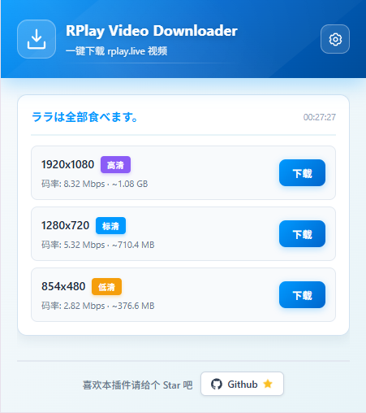
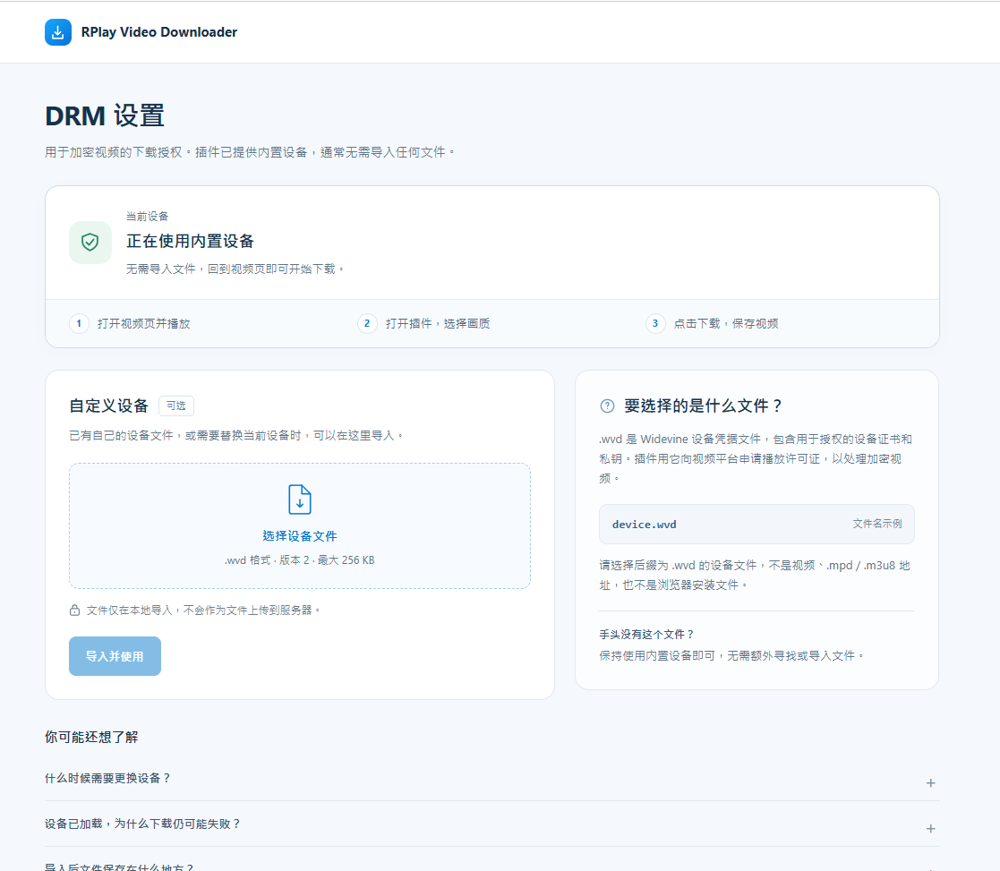

# RPlay Video Downloader

一个用于下载 `rplay.live` VOD/回放视频的 Chrome、Edge 浏览器扩展。

## 功能

- 自动检测 RPlay 页面中的视频。
- 识别 RPlay API 和 CDN（包括 `pb3.rplay.live`）上的 HLS 主清单，支持 URL 编码的 `s3key`。
- 对单独的 CMAF 视频轨、DASH 清单和 DRM / SAMPLE-AES 受保护媒体显示具体状态。
- 显示可用分辨率和码率，按需选择画质。
- 支持 DASH 点播：解析 `BaseURL` / `SegmentBase` 中的完整 CMAF/MP4 视频轨，自动配对音频并保存为 MP4。Widevine 加密的分片式 MP4/CMAF 轨道可通过插件内置的软件 CDM 授权并解密。

## 安装

### 1. 下载并解压

点击 GitHub 页面右上角的 **Code → Download ZIP**，下载后将 ZIP 完整解压到一个固定目录。

不要直接在压缩包内打开或加载扩展；以后也不要随意删除这个解压目录。

### 2. 加载扩展

1. 打开浏览器扩展管理页：
   - Chrome：`chrome://extensions/`
   - Edge：`edge://extensions/`
2. 开启右上角的“开发者模式”。
3. 点击“加载已解压的扩展程序”。
4. 选择刚刚解压的项目根目录，也就是包含 `manifest.json` 的目录。

> 应选择项目根目录，不要单独选择 `dist` 目录。

## 使用方法

1. 打开一个 RPlay 视频页面并开始播放。
2. 等待页面提示扩展已检测到视频。
3. 点击浏览器工具栏中的扩展图标。
4. 选择需要的清晰度，然后点击下载。
5. 下载完成后，浏览器会询问或自动保存文件，具体取决于浏览器的下载设置。

如果扩展图标没有显示，可以在浏览器的扩展菜单中将它固定到工具栏。

## 支持的浏览器与视频

- Chrome 116 或更高版本。
- Edge 116 或更高版本。
- Chromium 内核的其他浏览器可能可用，但未保证完全兼容。
- 支持 RPlay 的 VOD/回放 HLS 视频，以及单时段、完整轨道文件形式的 DASH 点播。已验证 Widevine CENC / CBCS 分片式 MP4 音视频。
- MP4 主要支持 H.264 + AAC 视频。
- 传统 MPEG-TS 视频可在符合条件时自动回退保存为 `.ts`。

## 隐私

- 扩展不会加载远程脚本、远程模块或远程字体。
- 联网请求用于 RPlay 的视频清单、媒体分片、AES-128 密钥和播放器的 EZDRM 许可证接口；Widevine 授权、许可证处理和解密均在插件中进行。
- 视频地址和密钥信息不会发送到第三方统计或分析服务。
- 下载文件由浏览器保存到用户选择的本地位置。

## 免责声明

本扩展仅供学习交流使用。下载内容前请确保你拥有相应权利，并遵守服务条款及当地法律。
