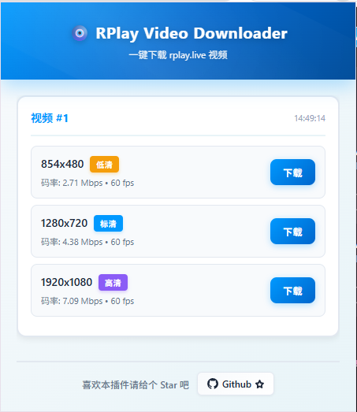

# RPlay Video Downloader

一个用于下载 `rplay.live` VOD/回放视频的 Chrome、Edge 浏览器扩展。

无需安装 Node.js、pnpm 或 FFmpeg。下载项目 ZIP、解压，然后在浏览器中选择插件目录即可使用。

## 功能

- 自动检测 RPlay 页面中的视频。
- 显示可用分辨率和码率，按需选择画质。

## 安装

### 1. 下载并解压

点击 GitHub 页面右上角的 **Code → Download ZIP**，下载后将 ZIP 完整解压到一个固定目录。

不要直接在压缩包内打开或加载扩展；以后也不要随意删除这个解压目录。

### 2. 加载扩展

1. 打开浏览器扩展管理页：
   - Chrome：`chrome://extensions/`
   - Edge：`edge://extensions/`
2. 开启右上角的“开发者模式”。
3. 点击“加载已解压的扩展程序”。
4. 选择刚刚解压的项目根目录，也就是包含 `manifest.json` 的目录。

> 应选择项目根目录，不要单独选择 `dist` 目录。

## 使用方法

1. 打开一个 RPlay 视频页面并开始播放。
2. 等待页面提示扩展已检测到视频。
3. 点击浏览器工具栏中的扩展图标。
4. 选择需要的清晰度，然后点击下载。
5. 下载完成后，浏览器会询问或自动保存文件，具体取决于浏览器的下载设置。

如果扩展图标没有显示，可以在浏览器的扩展菜单中将它固定到工具栏。

## 更新

1. 重新下载最新的项目 ZIP。
2. 解压并替换原来的插件目录。
3. 打开扩展管理页。
4. 点击本扩展卡片上的“重新加载”按钮。

## 支持的浏览器与视频

- Chrome 116 或更高版本。
- Edge 116 或更高版本。
- Chromium 内核的其他浏览器可能可用，但未保证完全兼容。
- 主要支持 RPlay 的 VOD/回放 HLS 视频。
- MP4 主要支持 H.264 + AAC 视频。
- 传统 MPEG-TS 视频可在符合条件时自动回退保存为 `.ts`。

## 隐私

- 扩展不会加载远程脚本、远程模块或远程字体。
- 联网请求仅用于获取 RPlay 的视频清单、媒体分片和必要的 AES-128 密钥。
- 视频地址和密钥信息不会发送到第三方统计或分析服务。
- 下载文件由浏览器保存到用户选择的本地位置。

## 免责声明

本扩展仅供学习交流使用。下载内容前请确保你拥有相应权利，并遵守服务条款及当地法律。
